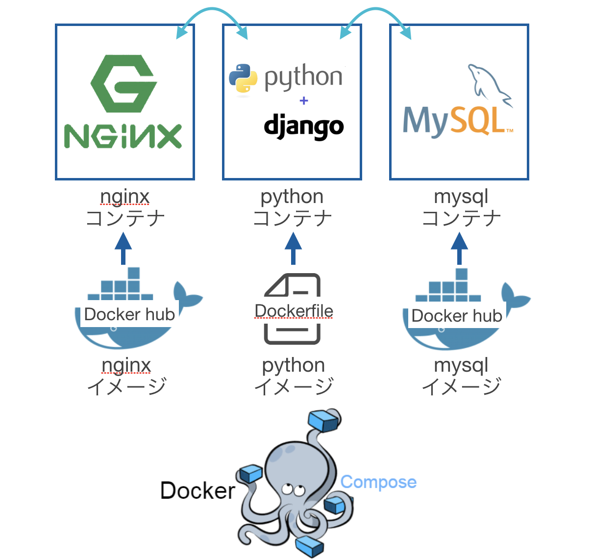

# Docker × DjangoのWEBアプリインフラ

### 使用する技術

- Docker
	- 各アプリケーション・ミドルウェアをコンテナ化し、Docker composeで管理する
- Django
	- PythonのWEBアプリケーションフレームワーク
- Nginx
	- WEBサーバ構築用のミドルウェア
- WSGI (Web Server Gateway Interface)
	- Pythonで記述されたWEBアプリケーションとWEBサーバをつなぐためのインターフェース
	- ※ DjangoだけでもWEBサーバとして機能する(httpリクエストをさばける)が、ApatcheやNginx上で動かす方が速度面等で良いらしい 
	- httpリクエスト → nginx → wsgi → django → wsgi → nginx → httpレスポンス
- MySQL
	- データベース 

-----

### 構成

- nginxコンテナ, pythonコンテナ, mysqlコンテナをDocker composeで連携させている 



- 開発環境構築と本番環境構築を分けて諸々設定ファイルを記述している


- ※ 本番環境(AWS上)のイメージ

----

### 実行方法

- ※ DjangoのPJ名を変更したい場合
	- rename\_djangoPJ.shのnew\_pj\_nameに新しいPJ名を記入
	- シェルスクリプト実行  

	```
		$ chmod +x rename_djangoPJ.sh
		$ ./rename_djangoPJ.sh
	```

- 開発環境(ローカル)で実行する場合

	- Docker compose インストール

	- コンテナ生成・起動

	```
		$ cd docker_infra
		$ docker-compose -f docker-compose.yml -f docker-compose.dev.yml build  
		$ docker-compose -f docker-compose.yml -f docker-compose.dev.yml up
	```
	
	- アクセス (localhost:8000) 
	

- 本番環境(EC2)で実行する場合
	- AWSのインフラ構築	 	

		- ネットワーク設定 (EC2のport:80を空ける)
	
	- Docker compose インストール

	- コンテナ生成・起動

	```
		$ cd docker_infra
		$ docker-compose -f docker-compose.yml -f docker-compose.product.yml build  
		$ docker-compose -f docker-compose.yml -f docker-compose.product.yml up
	```
	
	- アクセス (ec2のIP)

---
### Django開発の注意事項

- migrationの仕方

	- コンテナ内の環境でmigrateを実行するようにする
		- pythonコンテナに入る or 外からコンテナに対してコマンドを投げる 
   
	- 開発と本番のどちらのsettingファイルを使用するか明示する

```
	# コンテナに入るパターン
	
	# pythonコンテナに入る
	$ docker exec -i -t {pythonコンテナ名} bash
	# 開発環境
	$ python djangoPJ/manage.py migrate --settings=djangoPJ.settings.dev
	# 本番環境
	$ python djangoPJ/manage.py migrate --settings=djangoPJ.settings.product
```

```
	# 外からコンテナ内にコマンドを投げるパターン
	
	$ cd docker_infra
	# 開発環境
	$ docker-compose -f docker-compose.yml -f docker-compose.dev.yml run python python djangoPJ/manage.py migrate --settings=djangoPJ.settings.dev
	# 本番環境
	$ docker-compose -f docker-compose.yml -f docker-compose.product.yml run python python djangoPJ/manage.py migrate --settings=djangoPJ.settings.product

``` 

---

### TODO

- Django
	- DBの確認
		- Amazon RDSとかと疎通出来るか
	- 静的ファイルの確認

---

### 参照

- 全体
	- [docker+nginx+uwsgi+djangoでwebアプリ作成](https://qiita.com/hayatetabata/items/7b51acedeb3d4e84dd12) 

- Docker
	- [Docker Composeでコンテナに入る方法](https://qiita.com/setouchi/items/ebfeefb7d5b129002177) 
	- [Docker Composeでビルドしたイメージ名について](https://amaya382.hatenablog.jp/entry/2017/04/03/034002)
	- [開発環境と本番環境でdocker-composeを分ける方法](https://qiita.com/urouro_n/items/6a026eb635cc7d0e034f)
	- [Docker composeのネットワークについて](https://qiita.com/roba4coding/items/efd3a38db08eb476d412)
	
- WSGI
	- [WSGIとDjangoの関係](http://d.hatena.ne.jp/hirokiky/20121001/1349098637) 
	- [uwsgi.iniの記述について](https://qiita.com/hogemax/items/a3b04f0e848f52ff888e)

- Django
	- [EC2でDjangoを動かす](https://qiita.com/kur/items/fb75354ee53671c79614) 
	- [開発環境と本番環境でsettingを分ける方法](https://qiita.com/okoppe8/items/e60d35f55188c0ab9ecc)

- DB
	- [dockerでdjangoとmysql連携](https://qiita.com/cortyuming/items/e587fc045ee7424466b0) 

- Nginx
	- [Djangoで静的ファイルを扱う](http://djandjan.hateblo.jp/entry/2018/03/08/225014) 